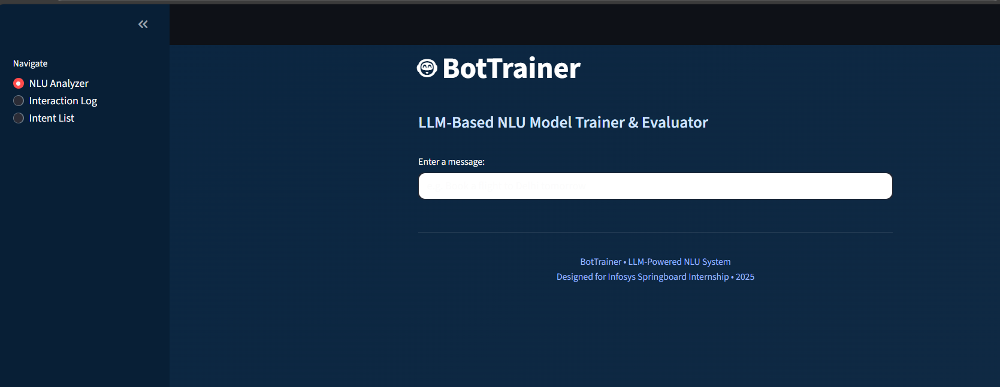
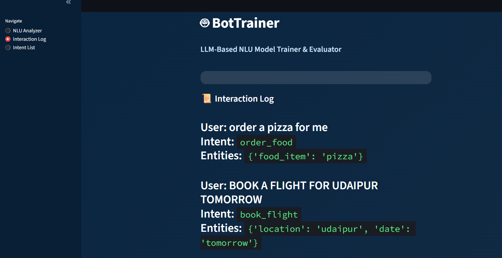
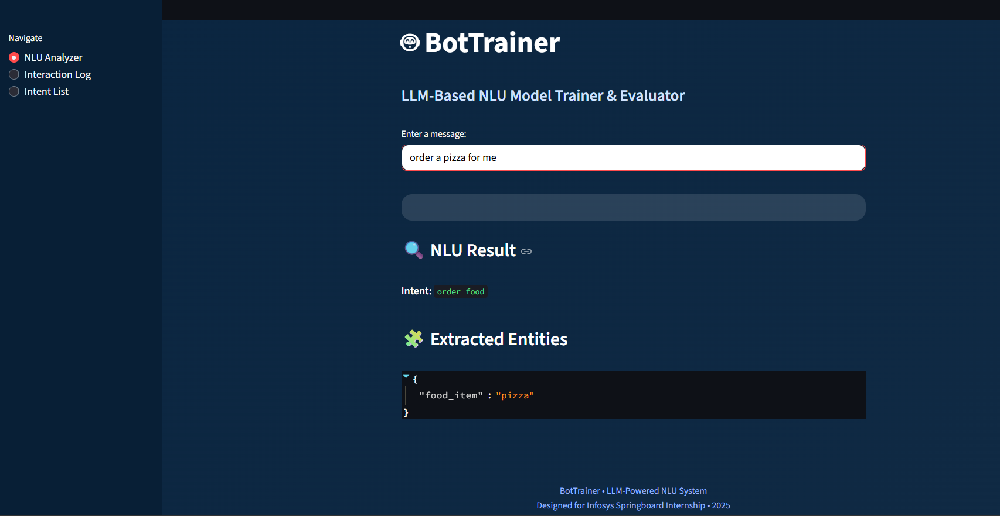

# 🤖 BotTrainer – LLM-Based NLU Model Trainer & Evaluator for Chatbots

BotTrainer is an end-to-end **LLM-powered Natural Language Understanding (NLU) system** designed to train, test, and evaluate chatbot NLU pipelines.  
The project replaces traditional ML-based intent classifiers with **modern Large Language Models (LLMs)** using prompt engineering and structured JSON outputs.

The system is **dataset-driven and scalable**, supporting **N-number of intents** without requiring any code changes.

---

## 🎯 Problem Statement

The goal of this project is to build a complete NLU pipeline capable of:
- Understanding user messages
- Predicting user intent
- Extracting relevant entities
- Evaluating model performance
- Providing an interactive and professional UI

The project demonstrates how LLMs can be used as a replacement for classical ML-based NLU systems.

---

## 🚀 Key Features

- Open-domain user input handling
- LLM-based intent classification
- Dataset-driven **N-intent scalability**
- Intent-aware entity extraction
- Structured JSON output
- Model evaluation (Accuracy, Precision, Recall, F1-score)
- Confusion matrix & error analysis
- Professional Streamlit UI with sidebar navigation
- Interaction logging & explainability

---

## 🧠 Architecture Overview

User Input
↓
Intent Classification (LLM)
↓
Entity Extraction (Intent-aware)
↓
Structured JSON Output
↓
Evaluation Metrics
↓
Streamlit UI Visualization


The system dynamically loads intents and entity schemas from a dataset (`intents.json`), allowing easy scalability without code changes.

---

## 📦 Dataset Structure

### `data/intents.json`

```json
{
  "intents": [
    {
      "name": "book_flight",
      "examples": ["Book a flight to Delhi"],
      "entities": ["location", "date"]
    }
  ]
}


---
```

## 🛠️ Tech Stack

- **Programming Language:** Python
- **Large Language Models:** LLaMA (via Groq API)
- **Frontend/UI:** Streamlit
- **Evaluation:** scikit-learn
- **Data Format:** JSON
- **Version Control:** Git & GitHub

---

## ⚙️ Installation & Setup

```bash
git clone https://github.com/nishb2715/BotTrainer.git
cd BotTrainer
conda create -n infosys_env python=3.10
conda activate infosys_env
pip install -r requirements.txt
```

## 📊 Model Evaluation

The system evaluates intent prediction performance using standard classification metrics:

- **Accuracy**
- **Precision**
- **Recall**
- **F1-score**

A **confusion matrix** is used for detailed error analysis and to identify misclassified intents.  
Insights from this analysis are used to improve prompt quality through few-shot learning.

---

## 🖥️ Streamlit Interface

The Streamlit application provides the following sections:

- **NLU Analyzer** – Test intent classification and entity extraction
- **Interaction Log** – View conversation history and predictions
- **Intent List** – Display all supported intents dynamically (N-intent scalability)

---

## 📸 Screenshots

### NLU Analyzer


### Interaction Log


### Supported Intents (N-Intent Scalability)


## 🌐 Public Deployment

🔗 **Live App Link:** *(https://bottrainer-fuwrdkdteg6krukhvdwvbr.streamlit.app/)*

---

## 🎥 Demo Video

📎 **Demo Video Link:** *(https://youtu.be/b2-UTJOSXUY)*
